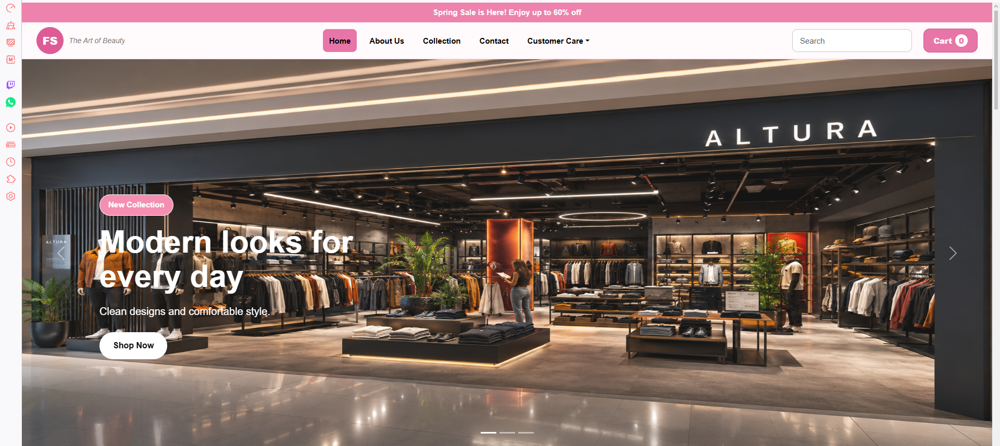
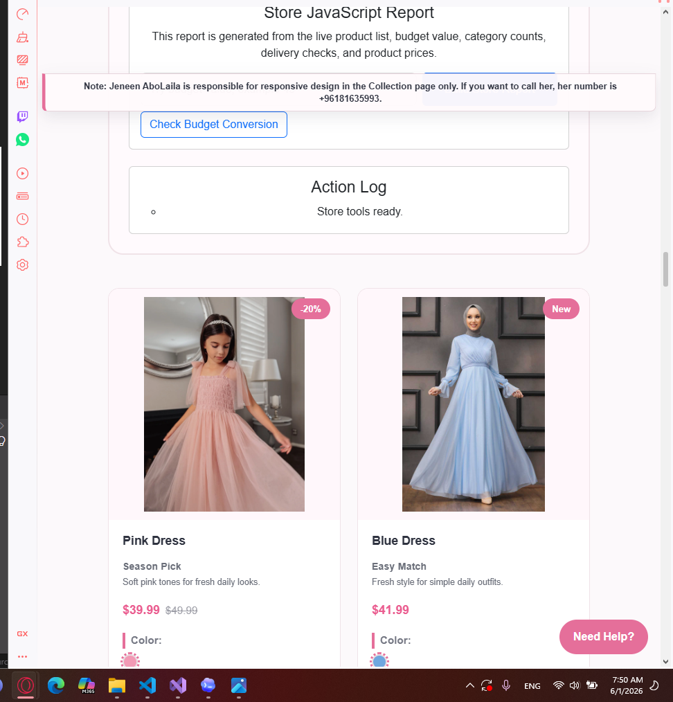
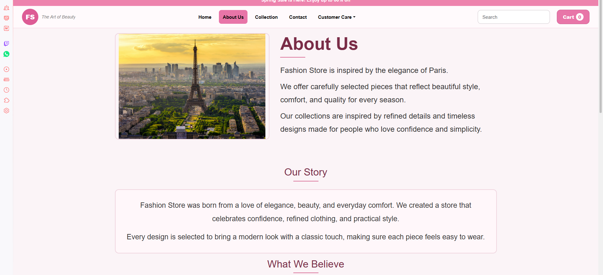
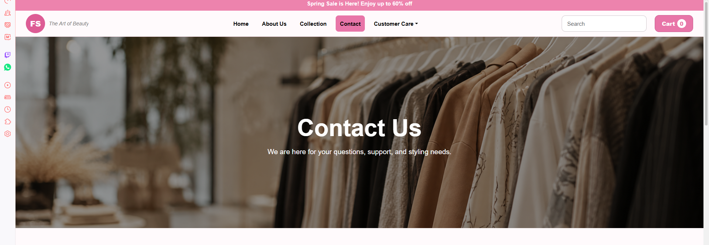
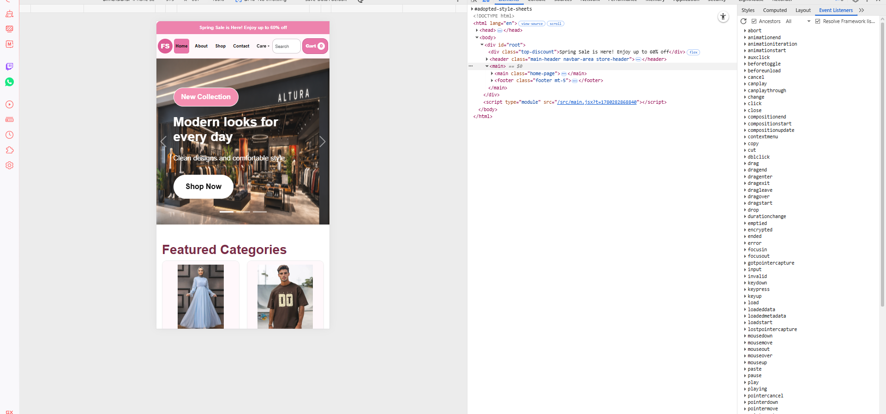

# Fashion Store - React Frontend Project

## Department

Department of Computer Science and Information Technology
CSCI390: Web Programming
Project Phase 2

## Project Description

Fashion Store is a responsive ReactJS frontend web application for an online clothing store. The website presents fashion collections, product categories, top deals, shopping information, and contact/support pages in a clean and user-friendly interface.

The project continues Phase 1 and improves it into a functional frontend application using React components, routing, responsive layout, and organized styling.

## Objective

The goal of this project is to apply web design and development principles using ReactJS as a frontend framework. The project also demonstrates responsive web design, UI/UX design, Git version control, GitHub repository management, and frontend deployment.

## Features

* Responsive Home page with hero carousel
* Product/category sections
* About page
* Contact page
* Help, Support, Returns, Size Guide, and Cart pages
* Search bar and cart button in the navbar
* Responsive layout for mobile, tablet, iPad, laptop, and desktop
* Reusable React components
* Organized CSS styling
* Git and GitHub version control
* Frontend deployment using Vercel

## Pages

The application includes more than four pages:

* Home
* Products
* About
* Contact
* Help
* Support
* Returns
* Size Guide
* Cart

## Technologies Used

* ReactJS
* Vite
* JavaScript
* HTML5
* CSS3
* Bootstrap
* Git
* GitHub
* Vercel

## Project Structure

```text
clothes-store/
├── frontend/
│   ├── src/
│   │   ├── assets/
│   │   ├── components/
│   │   ├── pages/
│   │   ├── styles/
│   │   │   └── style.css
│   │   ├── App.jsx
│   │   └── main.jsx
│   ├── package.json
│   └── vite.config.js
└── README.md
```

## Setup Instructions

### 1. Clone the repository

```bash
git clone https://github.com/32230466-Rana/clothes-store.git
```

### 2. Open the project

```bash
cd clothes-store/frontend
```

### 3. Install dependencies

```bash
npm install
```

### 4. Run the project locally

```bash
npm run dev
```

### 5. Open in browser

```text
http://localhost:5173
```

## Deployment

The frontend project is deployed using Vercel.

Deployment link:
https://clothes-store-taupe-delta.vercel.app/

## Project Images

These images are included in the project assets and use relative paths that work on GitHub.

### Home Page



### Products Page



### About Page



### Contact Page



### Collection Page


### Mobile Responsive View



### Customer Support


## Git and Version Control

This project uses Git for version control. The repository contains commit history showing project development, updates, fixes, and responsive design improvements.

## Group Contribution Statement

This project was completed by the group members as part of CSCI390 Web Programming Project Phase 2. Each member contributed to the design, development, testing, documentation, and final submission preparation.

## Authors

* Rana Hassan
* Jeneen Aboulaila

## Course Information

CSCI390: Web Programming
Project Phase 2
Department of Computer Science and Information Technology
